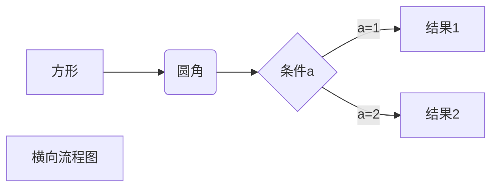
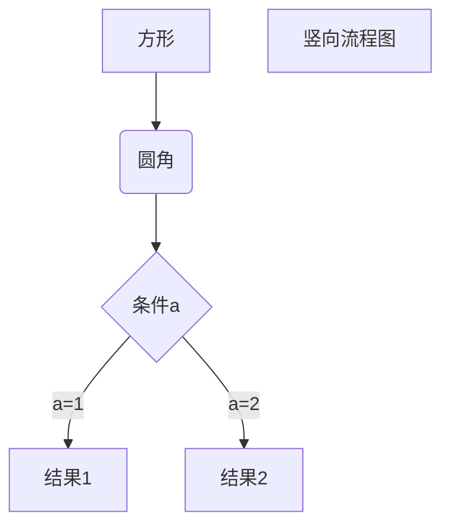
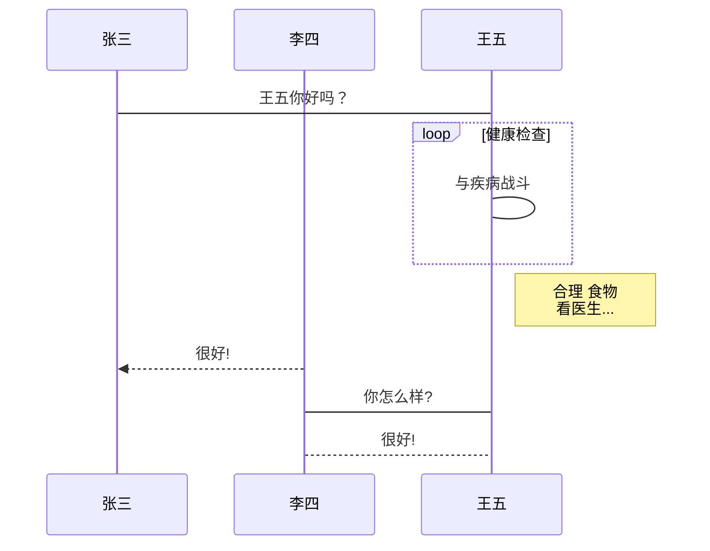
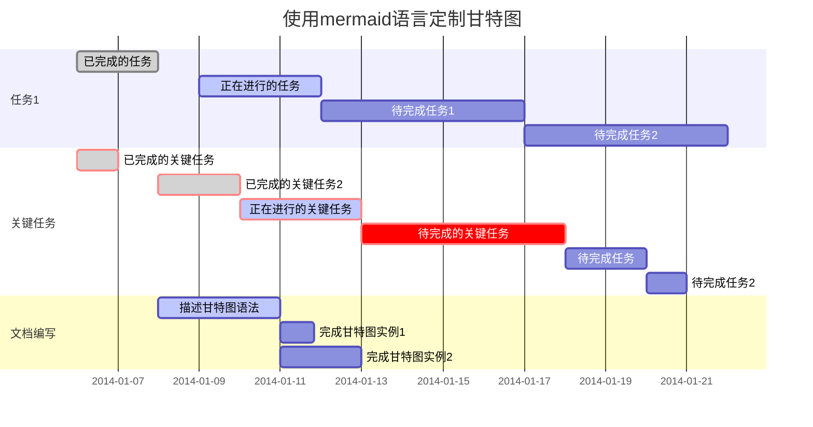

#高级技巧
## HTML
```
HTML
目前支持的 HTML 元素有：<kbd> <b> <i> <em> <sup> <sub> <br>等 
例如：
使用 <kbd>Ctrl</kbd>+<kbd>Alt</kbd>+<kbd>Del</kbd> 重启电脑
10<sup>2</sup> = 100
<b><i>i</i></b> <br/>
<b><em>em</em></b>
```
使用 <kbd>Ctrl</kbd>+<kbd>Alt</kbd>+<kbd>Del</kbd> 重启电脑

10<sup>2</sup> = 100

<b><i>i</i></b> <br/>
<b><em>em</em></b>

## 转义
```
使用斜杠转义特殊字符
```

/*

## 公式
```
$f(x) = sin(x) + 12$

$$\sum_{n=1}^{100}$$


$$
\begin{Bmatrix}
   a & b \\
   c & d
\end{Bmatrix}
$$
$$
\begin{CD}
   A @>a>> B \\
@VbVV @AAcA \\
   C @= D
\end{CD}
$$
```
$f(x) = sin(x) + 12$


## 流程图
1. 横向流程图源码格式：

2. 竖向流程图源码格式：

3. 标准流程图源码格式：
```flow
st=>start: 开始框
op=>operation: 处理框
cond=>condition: 判断框(是或否?)
sub1=>subroutine: 子流程
io=>inputoutput: 输入输出框
e=>end: 结束框
st->op->cond
cond(yes)->io->e
cond(no)->sub1(right)->op
```

4. 标准流程图源码格式（横向）：
```flow
st=>start: 开始框
op=>operation: 处理框
cond=>condition: 判断框(是或否?)
sub1=>subroutine: 子流程
io=>inputoutput: 输入输出框
e=>end: 结束框
st(right)->op(right)->cond
cond(yes)->io(bottom)->e
cond(no)->sub1(right)->op
```

5. UML时序图源码样例：
```sequence
对象A->对象B: 对象B你好吗?（请求）
Note right of 对象B: 对象B的描述
Note left of 对象A: 对象A的描述(提示)
对象B-->对象A: 我很好(响应)
对象A->对象B: 你真的好吗？
```

6. UML时序图源码复杂样例：
```sequence
Title: 标题：复杂使用
对象A->对象B: 对象B你好吗?（请求）
Note right of 对象B: 对象B的描述
Note left of 对象A: 对象A的描述(提示)
对象B-->对象A: 我很好(响应)
对象B->小三: 你好吗
小三-->>对象A: 对象B找我了
对象A->对象B: 你真的好吗？
Note over 小三,对象B: 我们是朋友
participant C
Note right of C: 没人陪我玩
```

7. UML标准时序图样例：



8. 甘特图样例：

